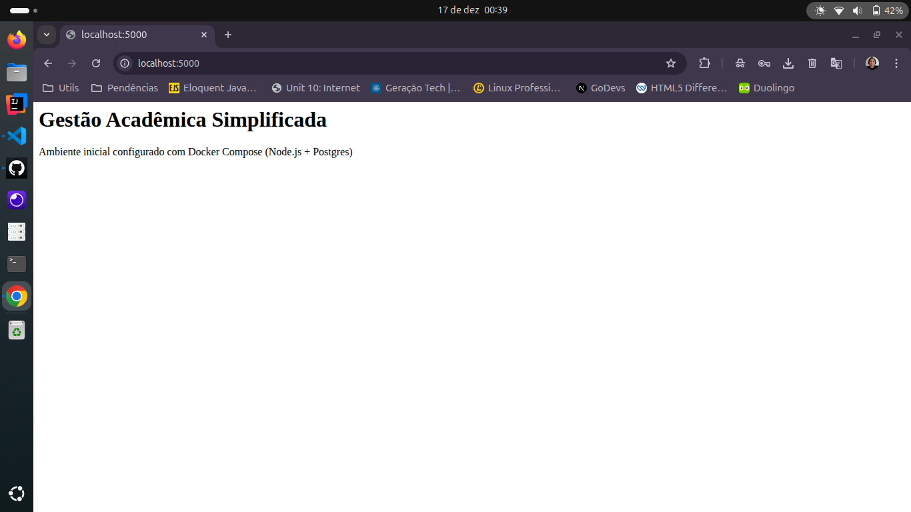

# Gestão Acadêmica Simplificada

Projeto de exemplo com **Node.js** e **PostgreSQL**, executado via **Docker**.

## 📸 Resultado da Execução

Abaixo, a comprovação do ambiente rodando localmente com Docker Compose:



## Requisitos

* Docker
* Docker Compose

## Executar

1. Clone o repositório:

   ```bash
   git clone https://github.com/seu-usuario/ambiente-software-docker-node.git
   cd ambiente-software-docker-node
   ```

2. Suba os containers:

   ```bash
   docker compose up --build
   ```

3. Acesse no navegador:

   ```
   http://localhost:5000
   ```

## Stack

* Node.js 18 + Express
* PostgreSQL 15
* Docker / Docker Compose

## Configuração

A aplicação usa a variável `DATABASE_URL`, já definida no `docker-compose.yml`.