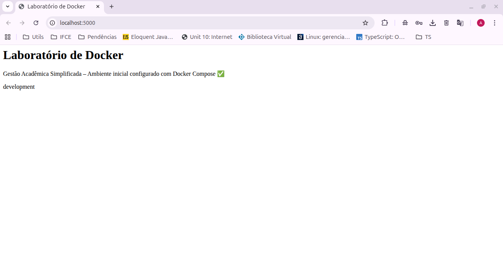

### 🐳 Laboratório de Docker
#### 🚀 Tecnologias
- Express
- PostgreSQL
- Docker

#### 🔧 Pré-requisitos
- Docker (versão 28.5.1 ou superior)

#### ⚙️ Configuração e Execução
1. **Baixando o projeto**:
 ``git clone https://github.com/ohnapaula/laboratorio-docker.git`` 
``cd gestao-academica``

2. **Definindo Variáveis de Ambiente**: Crie um arquivo ``.env`` na raiz do projeto (``/gestao-academica``) com as seguintes variáveis:
 ``POSTGRES_PASSWORD=<senha_do_postgres>``
``POSTGRES_USER=<usuario_do_postgres>``
``POSTGRES_DB=<nome_do_banco_de_dados>``

(**Obs**: Substitua os valores <...> pelos de sua preferência.)

3. **Rodando o Docker Compose**: Execute o comando abaixo na raiz do projeto:
 ``docker compose up --build -d``

A aplicação estará disponível em: ``http://localhost:5000/``

4. **Demonstração do projeto**:

  

